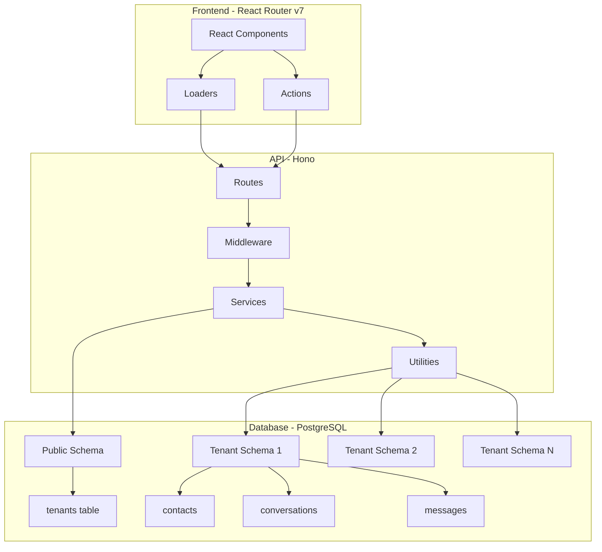
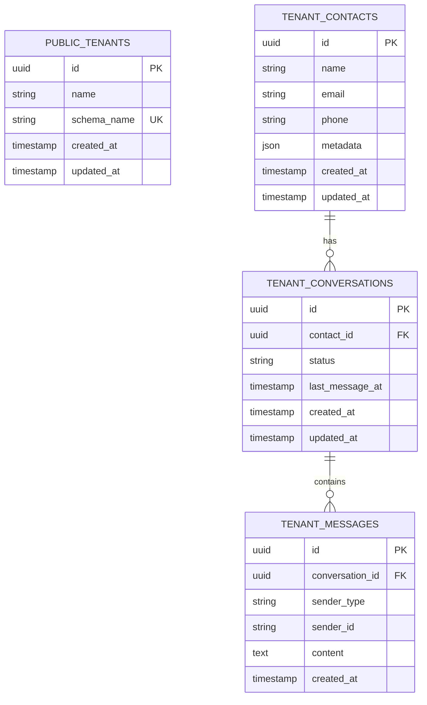

# Design Document

## Overview

This design document outlines the technical architecture and implementation approach for a schema-based multi-tenant CRM system. The solution leverages PostgreSQL's schema isolation capabilities to provide complete data segregation between tenants while maintaining a unified application layer. The system is built on a pnpm monorepo with a Hono TypeScript API backend and React Router v7 SSR frontend.

### Key Design Principles

- **Complete Data Isolation**: Each tenant operates within its own PostgreSQL schema
- **Dynamic Schema Management**: Automatic schema creation and migration on tenant registration
- **Connection Scoping**: All database queries are automatically scoped to the correct tenant schema
- **Stateless API**: Tenant context is determined per request via headers or JWT tokens
- **Type Safety**: Full TypeScript implementation with strict typing across the stack

## Architecture

### System Architecture Diagram



### Database Schema Architecture



## Components and Interfaces

### API Layer Components

#### 1. Database Configuration (`packages/api/src/config/database.ts`)
```typescript
interface DatabaseConfig {
  connection: {
    host: string;
    port: number;
    user: string;
    password: string;
    database: string;
  };
  pool: {
    min: number;
    max: number;
  };
}
```

#### 2. Tenant Context Management (`packages/api/src/middleware/tenant.ts`)
```typescript
interface TenantContext {
  tenantId: string;
  schemaName: string;
  knex: Knex;
}

// Middleware to extract tenant from request
async function tenantMiddleware(c: Context, next: Next): Promise<void>
```

#### 3. Migration Manager (`packages/api/src/services/migration.service.ts`)
```typescript
interface MigrationService {
  createTenantSchema(schemaName: string): Promise<void>;
  runTenantMigrations(schemaName: string): Promise<void>;
  rollbackTenantMigrations(schemaName: string): Promise<void>;
}
```

#### 4. Database Utilities (`packages/api/src/utils/database.ts`)
```typescript
// Core utility for tenant-scoped database access
function getTenantKnex(tenantId: string): Promise<Knex>;
function withSchema(knex: Knex, schemaName: string): Knex;
```

### Frontend Layer Components

#### 1. API Client (`packages/web/app/lib/api.ts`)
```typescript
interface ApiClient {
  createTenant(data: TenantInput): Promise<Tenant>;
  createContact(tenantId: string, data: ContactInput): Promise<Contact>;
  addMessage(tenantId: string, data: MessageInput): Promise<Message>;
  getConversations(tenantId: string, contactId: string): Promise<Conversation[]>;
}
```

#### 2. Route Structure
```
app/routes/
├── _index.tsx           # Landing page with tenant signup
├── tenant.$id.tsx        # Tenant dashboard layout
├── tenant.$id.contacts.tsx    # Contact management
├── tenant.$id.contacts.$contactId.tsx  # Conversation view
└── tenant.$id.contacts.new.tsx        # Create contact form
```

## Data Models

### Public Schema Models

#### Tenant Model
```typescript
interface Tenant {
  id: string;           // UUID
  name: string;         // Company name
  schema_name: string;  // PostgreSQL schema name (sanitized)
  created_at: Date;
  updated_at: Date;
}
```

### Tenant Schema Models

#### Contact Model
```typescript
interface Contact {
  id: string;          // UUID
  name: string;
  email?: string;
  phone?: string;
  metadata?: Record<string, any>;
  created_at: Date;
  updated_at: Date;
}
```

#### Conversation Model
```typescript
interface Conversation {
  id: string;          // UUID
  contact_id: string;  // FK to contacts
  status: 'active' | 'archived' | 'closed';
  last_message_at?: Date;
  created_at: Date;
  updated_at: Date;
}
```

#### Message Model
```typescript
interface Message {
  id: string;           // UUID
  conversation_id: string;  // FK to conversations
  sender_type: 'user' | 'contact' | 'system';
  sender_id?: string;
  content: string;
  created_at: Date;
}
```

## API Endpoints Design

### 1. POST /tenants
**Purpose**: Create new tenant with schema
```typescript
// Request
{
  name: string;
}

// Response
{
  id: string;
  name: string;
  schema_name: string;
  created_at: string;
}

// Process Flow:
1. Validate tenant name
2. Generate unique schema name
3. Begin transaction
4. Insert tenant record in public.tenants
5. Create new PostgreSQL schema
6. Run tenant migrations in new schema
7. Commit transaction or rollback on error
```

### 2. POST /contacts
**Purpose**: Create contact with auto-conversation
```typescript
// Headers
X-Tenant-Id: string

// Request
{
  name: string;
  email?: string;
  phone?: string;
  metadata?: object;
}

// Response
{
  contact: Contact;
  conversation: Conversation;
}

// Process Flow:
1. Validate tenant context
2. Get tenant-scoped Knex instance
3. Begin transaction
4. Insert contact record
5. Create initial conversation
6. Commit transaction
```

### 3. POST /messages
**Purpose**: Add message to conversation
```typescript
// Headers
X-Tenant-Id: string

// Request
{
  conversation_id: string;
  content: string;
  sender_type: 'user' | 'contact';
  sender_id?: string;
}

// Response
{
  id: string;
  conversation_id: string;
  content: string;
  created_at: string;
}

// Process Flow:
1. Validate tenant context
2. Verify conversation exists in tenant schema
3. Insert message
4. Update conversation.last_message_at
```

### 4. GET /conversations/:contactId
**Purpose**: Retrieve conversations with messages
```typescript
// Headers
X-Tenant-Id: string

// Response
{
  conversations: Array<{
    id: string;
    contact_id: string;
    status: string;
    messages: Message[];
    created_at: string;
  }>;
}

// Process Flow:
1. Validate tenant context
2. Query conversations for contact
3. Eager load messages ordered by created_at
4. Return nested structure
```

## Error Handling

### Error Types and Responses

#### 1. Schema Creation Errors
```typescript
class SchemaCreationError extends Error {
  code = 'SCHEMA_CREATION_FAILED';
  statusCode = 500;
}
```

#### 2. Tenant Not Found
```typescript
class TenantNotFoundError extends Error {
  code = 'TENANT_NOT_FOUND';
  statusCode = 404;
}
```

#### 3. Invalid Tenant Context
```typescript
class InvalidTenantContextError extends Error {
  code = 'INVALID_TENANT_CONTEXT';
  statusCode = 401;
}
```

#### 4. Validation Errors
```typescript
class ValidationError extends Error {
  code = 'VALIDATION_FAILED';
  statusCode = 400;
  fields: Record<string, string[]>;
}
```

### Error Handling Strategy

1. **Database Transaction Rollback**: All schema operations wrapped in transactions
2. **Graceful Degradation**: If tenant schema unavailable, return maintenance message
3. **Logging**: Structured logging with correlation IDs for request tracing
4. **Client Error Display**: User-friendly error messages in UI with recovery actions

## Testing Strategy

### Unit Testing

#### API Tests
- **Utility Functions**: Test getTenantKnex scoping logic
- **Services**: Mock Knex for migration service tests
- **Validation**: Test input validation rules
- **Error Handling**: Test error scenarios and rollback logic

#### Frontend Tests
- **Components**: Test form validation and submission
- **Loaders**: Mock API responses for loader tests
- **Actions**: Test form action error handling
- **API Client**: Test request/response transformation

### Integration Testing

#### Database Integration
```typescript
// Test schema isolation
1. Create two test tenants
2. Insert data in tenant1 schema
3. Verify data not visible when querying tenant2 schema
4. Clean up test schemas after tests
```

#### API Integration
```typescript
// Test complete tenant lifecycle
1. POST /tenants - Create new tenant
2. POST /contacts - Add contact to tenant
3. POST /messages - Add messages
4. GET /conversations - Verify data retrieval
5. Verify schema cleanup in teardown
```

### End-to-End Testing

#### Critical User Flows
1. **Tenant Onboarding Flow**
   - Navigate to signup page
   - Submit tenant registration form
   - Verify schema creation and redirect

2. **Contact Management Flow**
   - Create new contact
   - Verify conversation auto-creation
   - Add messages to conversation
   - View conversation history

3. **Cross-Tenant Isolation**
   - Create multiple tenants
   - Verify data isolation between tenants
   - Test unauthorized access attempts

### Test Environment Configuration

```typescript
// Test database configuration
{
  test: {
    connection: {
      database: 'crm_test',
      // Separate test database
    },
    migrations: {
      directory: './migrations',
      schemaName: 'test_schema_*' // Prefix for test schemas
    }
  }
}
```

## Security Considerations

1. **Schema Name Sanitization**: Prevent SQL injection in schema names
2. **Tenant Isolation**: Enforce tenant context at middleware level
3. **Connection Pooling**: Separate pools per tenant for complete isolation
4. **Input Validation**: Strict validation on all user inputs
5. **Rate Limiting**: Prevent abuse of tenant creation endpoint
6. **CORS Configuration**: Proper CORS setup for frontend-backend communication